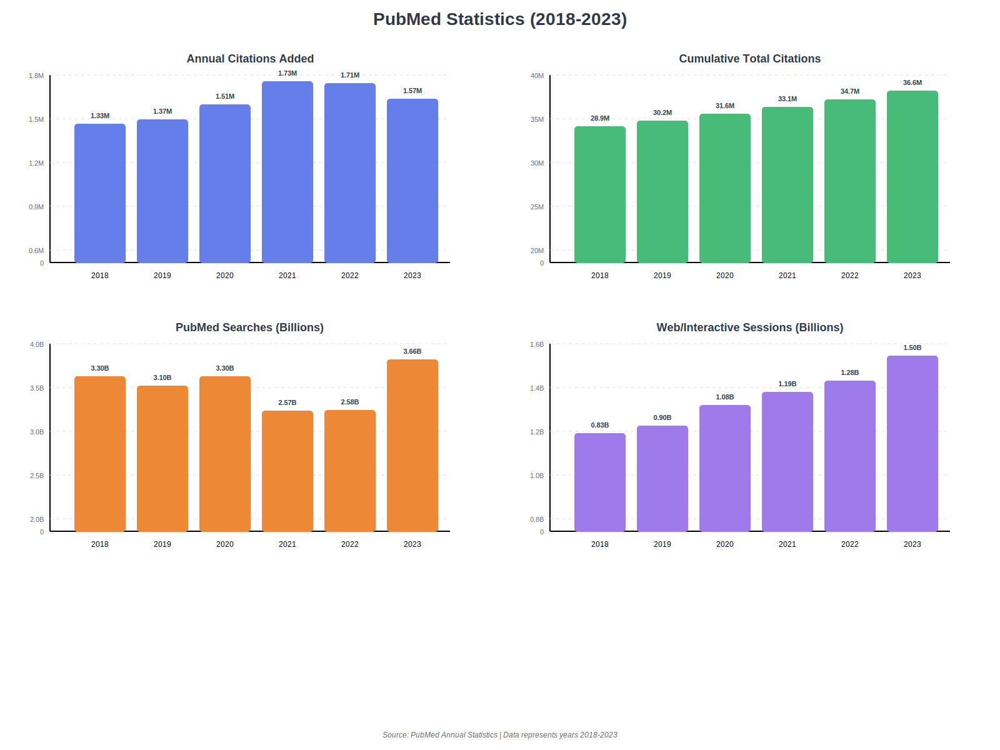

# Biomedical Literature Mining

## Project Overview

This is an **Biomedical Literature Mining System** that automatically searches, analyzes, and extracts knowledge from scientific papers on PubMed. It combines multiple NLP techniques to provide intelligent summaries, entity extraction, and knowledge graph construction.



#### Need for Biomedical Literature Mining Project:

Overwhelming Volume: With 36.6 million cumulative citations and 1.57 million new papers added annually, manual literature review is practically impossible for researchers, necessitating automated mining tools.
High Information Demand: 3.66 billion PubMed searches in 2023 demonstrate massive demand for finding relevant research, yet most users struggle to efficiently extract and synthesize information from this vast database.
Accelerating Growth: The exponential increase from 28.9M to 36.6M papers (2018-2023) and 1.5 billion web sessions show that traditional search methods cannot keep pace—AI-powered literature mining is essential for timely knowledge discovery.

---
### **Key Technologies**

| Component | Technology | Purpose |
|-----------|-----------|---------|
| **PubMed API** | Biopython (Entrez) | Paper search & retrieval |
| **Semantic Search** | SentenceTransformers | Embedding-based ranking |
| **Summarization** | BART (Seq2Seq) | Neural abstractive summarization |
| **NER** | Transformer (biomedical-ner-all) | Entity extraction |
| **Sentence Tokenization** | NLTK | Text segmentation |
| **Web UI** | Gradio | Interactive interface |

---
### **Project NLP Flow**


---
### How to Run:
app.py (Flask - Rule-Based)

- Simple extractive summarization (keyword scoring)
- Pattern-based entity extraction (regex + dictionaries)
- Rule-based relationships (regex patterns)
- NLTK for basic NLP (tokenization, stopwords)
```bash
pip install flask biopython nltk python-dotenv
python app.py
```
final_app.py (Gradio - Advanced NLP)

- BART neural summarization (Facebook's transformer model)
- Biomedical NER (sschet/biomedical-ner-all - trained on medical texts)
- Semantic ranking (sentence-transformers for relevance scoring)
- PyTorch + Transformers (state-of-the-art deep learning)
  
```bash
pip install biopython transformers sentencepiece nltk sentence-transformers gradio torch
python final_app.py
```

## Complete Workflow

### **Phase 1: Data Acquisition & Ranking**

#### 1.1 PubMed Search (`pubmed.py`)
- **Input**: User query (e.g., "AlphaFold 3 drug discovery")
- **Process**:
  - Connects to NCBI PubMed API using Biopython
  - Adds filters: `AND humans[MeSH Terms] AND english[lang]`
  - Retrieves top 20 paper IDs (PMIDs) by relevance
  - Fetches metadata: title, abstract, authors, journal, date
- **Output**: List of paper metadata dictionaries

#### 1.2 Semantic Ranking
- **Model**: `sentence-transformers/all-MiniLM-L6-v2`
- **Process**:
  - Encodes user query into embedding vector
  - Encodes each paper abstract into embedding vectors
  - Calculates cosine similarity between query and abstracts
  - Ranks papers by semantic relevance (not just keyword matching)
- **Output**: Top N most relevant papers with relevance scores

---

### **Phase 2: Text Preprocessing & Enhancement**

#### 2.1 Abbreviation Resolution (`abbreviation_resolver.py`)
- **Pattern Detection**:
  - Regex: `Full Form (ABBR)` pattern
  - Example: "Tumor Necrosis Factor (TNF)" → TNF = Tumor Necrosis Factor
- **Common Dictionary**:
  - Pre-loaded with 20+ common biomedical abbreviations (DNA, RNA, LPS, etc.)
- **Expansion**:
  - Replaces standalone abbreviations with full forms
  - Improves downstream NLP understanding
- **Output**: Expanded abstract text + abbreviation dictionary

#### 2.2 Markup Cleaning
- **Process**:
  - Removes HTML/XML tags: `<sup>...</sup>`, `<i>`, etc.
  - Removes bullet characters and special formatting
  - Normalizes whitespace
- **Purpose**: Clean text for accurate NLP processing

---

### **Phase 3: Intelligent Summarization**

#### 3.1 Neural Summarization (`text_summarizer_dynamic.py`)
- **Model**: BART (Facebook/bart-large-cnn)
- **Features**:
  - **Query-Aware**: Focuses on aspects relevant to user's search
  - **Title-Aware**: Analyzes title focus to boost relevant content
  - **Beam Search**: Generates high-quality summaries (num_beams=4)
  - **Length Control**: min=50, max=200 tokens
- **Process**:
  ```
  1. Extract query keywords (e.g., "microbiome", "gut", "health")
  2. Analyze title focus score (0.0 to 1.0)
  3. Generate neural summary conditioned on query
  4. Apply no_repeat_ngram_size=3 to avoid repetition
  ```
- **Output**: Concise, query-focused summary (50-200 words)

#### 3.2 Sentence Scoring & Ranking
- **Scoring Algorithm**:
  ```
  Score = (Query Match * 0.6) + (Universal Keywords * 0.25) + (Length * 0.15)
  Final Score = Score * (1 + Title Focus * 0.3)
  ```
- **Universal Keywords**: "study", "find", "demonstrate", "significant", etc.
- **Length Preference**: 8-25 words (medium-length sentences)
- **Title Boost**: Papers highly focused on query get 30% boost
- **Output**: Ranked sentences with importance scores

---

### **Phase 4: Entity Extraction**

#### 4.1 Transformer-Based NER (`entity_extractor.py`)
- **Model**: `sschet/biomedical-ner-all`
- **Entity Types Detected**:
  - **Genes**: BRCA1, TP53, EGFR, etc.
  - **Diseases**: cancer, diabetes, leukemia, etc.
  - **Chemicals/Drugs**: Metformin, LPS, TNF-alpha, etc.
  - **Organisms**: E. coli, Lactobacillus, Firmicutes, etc.
  - **Other**: Cell lines, diagnostic procedures, etc.
- **Process**:
  ```
  1. Tokenize summary text
  2. Run transformer model for token classification
  3. Aggregate tokens into entities
  4. Map entity types (DISEASE → Disease, GENE → Gene)
  5. Calculate confidence scores (0.0 to 1.0)
  ```
- **Output**: List of entities with:
  - Name
  - Type
  - Position (start, end)
  - Confidence score

#### 4.2 Pattern-Based Enhancement
- **Supplementary Patterns**:
  - Disease suffixes: `-itis`, `-osis`, `-emia`, `-pathy`
  - Gene patterns: All-caps with numbers (TP53, KRAS)
  - Organism patterns: Capitalized Genus + species
- **Purpose**: Catch entities missed by transformer model

---

### **Phase 5: Knowledge Graph Construction**

#### 5.1 Entity Aggregation (`knowledge_graph.py`)
- **Node Creation**:
  - Each unique entity becomes a node
  - Tracks: entity name, type, mention count
  - Deduplicates across all processed papers
- **Mention Tracking**:
  - Counts how many times each entity appears
  - Identifies most important entities
- **Structure**:
  ```json
  {
    "nodes": {
      "BRCA1": {"type": "Gene", "mentions": 5},
      "cancer": {"type": "Disease", "mentions": 12}
    }
  }
  ```

#### 5.2 Relationship Extraction (`relationship_extractor.py`)
- **Relationship Types**:
  - **ASSOCIATION**: "X associated with Y"
  - **CAUSATION**: "X causes Y", "X leads to Y"
  - **TREATMENT**: "X treats Y"
  - **ENRICHMENT**: "X enriched in Y"
  - **DEPLETION**: "X depleted in Y"
- **Regex Patterns**:
  ```python
  'associated with', 'linked to', 'causes', 'leads to',
  'treats', 'effective against', 'enriched in', etc.
  ```
- **Evidence Tracking**: Stores original sentence as evidence
- **Structure**:
  ```json
  {
    "source": "Metformin",
    "target": "diabetes",
    "type": "TREATMENT",
    "evidence": "Metformin is used to treat type 2 diabetes."
  }
  ```

---

### **Phase 6: Data Export & Visualization**

#### 6.1 CSV Export
- **Entities CSV**:
  ```
  Entity,Type,Mentions
  BRCA1,Gene,5
  cancer,Disease,12
  ```
- **Relationships CSV**:
  ```
  Source,Target,RelationType,Evidence
  Metformin,diabetes,TREATMENT,"Metformin treats diabetes."
  ```

#### 6.2 User Interface (Gradio)
- **Features**:
  - Search box with query input
  - Paper slider (1-5 papers)
  - Dropdown to select paper
  - Formatted summary display
  - Entity list with confidence scores
  - Top sentences with importance scores
  - Metadata: relevance score, title focus, keywords
  - CSV download buttons

---

##  Scoring Mechanisms

### **Title Focus Score**
- **Range**: 0.0 to 1.0
- **High (>0.7)**: Paper strongly focuses on query topics
- **Medium (0.4-0.7)**: Moderate relevance
- **Low (<0.4)**: Tangentially related

### **Relevance Score**
- **Range**: -1.0 to 1.0 (cosine similarity)
- **High (>0.5)**: Very relevant to query
- **Medium (0.3-0.5)**: Moderately relevant
- **Low (<0.3)**: Weakly relevant

### **Sentence Importance Score**
- **Components**:
  - Query keyword match (60% weight)
  - Universal importance words (25% weight)
  - Optimal length (15% weight)
  - Title focus boost (up to 30%)
- **Usage**: Extract most informative sentences

---

## Key Features

1. **Context-Aware Summarization**: Adapts to user's specific query
2. **Multi-Paper Analysis**: Process and compare multiple papers
3. **Entity Disambiguation**: Tracks entities across papers
4. **Evidence-Based Relationships**: Links entities with supporting text
5. **Export Capabilities**: Download structured data for further analysis
6. **Real-Time Processing**: Interactive UI with immediate results
---

## Future Enhancements

- Multi-document summarization
- Temporal analysis (track research over time)
- Graph visualization (interactive knowledge graph)
- Citation network analysis
- Support for full-text papers (not just abstracts)
- Advanced relationship inference using language models
